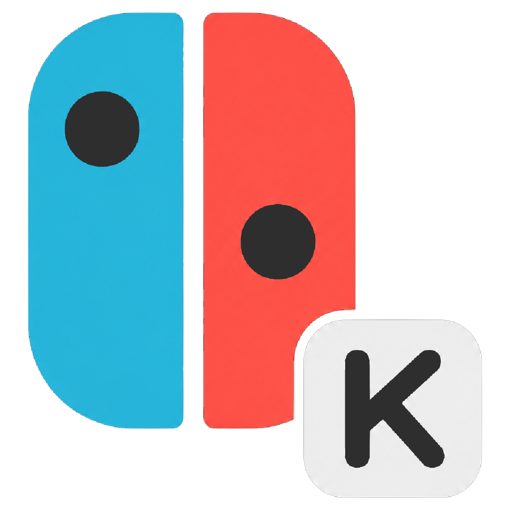
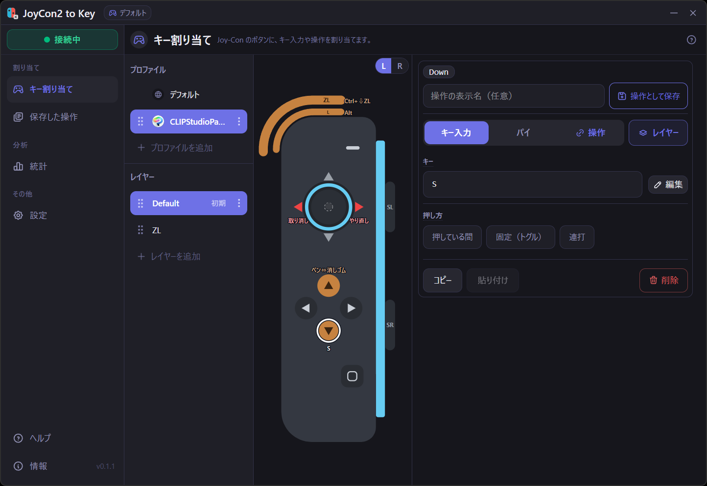

<p align="center">
  
</p>

# JoyCon2 to Key

*English: [README.en.md](README.en.md)*

[](https://github.com/pboaa/joycon2-to-key/releases/latest)
[](LICENSE)

**Nintendo Switch 2 の Joy-Con（Joy-Con 2）**を Windows の片手ショートカット
パッドとして使うデスクトップアプリです。ボタン・スティックを、キーボード
ショートカット / マウスクリック / スクロールに Bluetooth LE 経由で割り当て
られます。お絵描き・クリエイティブ系アプリ（Clip Studio、Photoshop、Blender
など）の左手デバイスとして便利です。



## ダウンロード

Windows 用インストーラは **[最新リリース（Releases）](https://github.com/pboaa/joycon2-to-key/releases/latest)** から入手できます（`JoyCon2.to.Key_*_x64-setup.exe` をダウンロードして実行）。一度インストールすれば、以降はアプリ内の自動更新で最新版に保てます。

[Tauri](https://tauri.app/) v2 + React + TypeScript 製。**Windows 専用**
（Win32 の `SendInput` API を使用）。

> **Windows の警告について**: 配布版のインストーラやアプリを初めて実行すると、
> 「WindowsによってPCが保護されました」という SmartScreen の警告が出ることがあります。
> コード署名をしていない個人開発アプリのための表示で、[詳細情報] →
> [実行]（または[このまま実行]）で続行できます。なお本アプリはキーボード／
> マウス入力を合成（Win32 `SendInput`）するため、セキュリティソフトやゲームの
> アンチチートに検知・ブロックされることがあります。

## 主な機能

- **BLE 直結** — Joy-Con 2（左 / 右）へ直接接続。接続が切れても待機を続ける常時
  再接続ループつきで、コントローラのシンクボタンを押せば自動で繋がり直します
  （アプリ側で「開始」を押し直す必要はありません）。
- **キー / マウス / スクロール** — 各ボタンにキーボードショートカット、マウス
  クリック（ダブルクリック含む）、ホイールスクロールを割り当て。動作は
  **タップ** / **ホールド**（押し続け）/ **トグル**（オン・オフ固定）/
  **連打**（押している間オートリピート）。
- **レイヤー** — ボタンを押している間だけ別レイヤーへ切り替え、少ない物理ボタンで
  多くの操作をカバー。
- **アプリ別プロファイル** — 前面ウィンドウのプロセス名に応じて割り当てを自動で
  切り替え。どれにも一致しないときはデフォルトプロファイル。
- **スティック** — スティックを 4 方向ボタンとして、またはマウスカーソルとして
  使用（レイヤーごと）。
- **パイメニュー** — ボタンを押しながらマウスを動かした方向で操作を発火。円形
  メニューに 2〜8 方向＋中央（その場）を割り当て可能。
- **再利用できる定義** — 操作を一度保存して複数ボタンに割り当て。定義を編集すると
  リンクされた全ボタンに反映。
- **放置時の自動切断** — 一定時間無操作になると、押しっぱなしのキーを解放し、BLE 接続を
  切って Joy-Con のバッテリーを節約します（切断の少し前に予告振動も可）。再び使うときは
  シンクボタンで再接続します。
- **テーマ** — ライト / ダーク＋カラーテーマ（抹茶猫・初雪）。システム追従も可。

## 動作環境

- **Windows 11 推奨** — 低遅延の BLE 接続間隔に Windows 11 build 22000+ が必要。
  古い版でも動作しますが入力遅延が大きくなります。
- Bluetooth LE アダプタ。
- **Nintendo Switch 2 Joy-Con**（左 / 右）。

## はじめに

```sh
# フロントエンド依存をインストール
npm install

# 開発モードで起動（ホットリロード）
npm run tauri dev

# リリースバンドル / インストーラをビルド
npm run tauri build
```

Rust ツールチェーンと Tauri のプラットフォーム前提条件が必要です。
[Tauri prerequisites ガイド](https://tauri.app/start/prerequisites/)を参照。

### コントローラの接続

1. アプリを起動。
2. Joy-Con 2 をペアリングモードにする（小さな**シンク**ボタンをライトが流れるまで
   長押し）。
3. アプリが自動でスキャン・接続し、接続インジケータがアクティブになります。

## 設定

すべてアプリ内で編集します。状態は per-user のアプリデータディレクトリにある
`workspace.json`（アプリ設定＋保存済み操作ライブラリ＋全プロファイル）に保存され、
変更のたびに書き込まれます。

各ボタンは 1 つの割り当てを持ちます。割り当てタイプ:

- **input** — キーボード / マウス / スクロール。`tap` / `hold` / `toggle` の各モード、
  連打用の `repeatMs`（任意）。
- **pie** — ボタンを押しながらマウスを動かした方向で操作を発火（パイメニュー）。
- **layerHold** — 押している間だけ別レイヤーへ切り替え（離すと元に戻る）。切替中に
  修飾キーを押し続けることも可能。

アプリ内の設定から全て編集できます。JSON の手編集にも対応。

## 仕組み

- `joycon/` — BLE のスキャン / 接続 / 再接続と Joy-Con 2 のフレーム解析
  （ボタン＋スティック）: `discovery` / `link` / `protocol` / `telemetry`。
- `input_thread.rs` — `SendInput` を専有する OS スレッド。非同期ランタイムから分離し、
  ブロッキング送信が BLE ストリームを止めないようにする。
- `processor/` — マッピングの状態機械（down / hold / up、プロファイル、レイヤー、
  パイ、連打、スティック→マウス）。
- `keyboard.rs` / `keys.rs` / `mouse.rs` — Win32 の入力送出と、キー名→仮想キーの対応。
- `config/` — config スキーマ（serde）と読み書き・組み込みデフォルト。
- React フロントエンド（`src/`）がメイン画面と設定 UI を提供。

## 商標について / 免責

本ソフトウェアは非公式の個人プロジェクトであり、**任天堂株式会社とは一切関係が
なく**、同社による承認・提携・出資を受けていません。"Nintendo Switch"、"Joy-Con"
およびその他の名称は、それぞれの権利者の商標です。本プロジェクトではこれらを
互換性・識別の目的でのみ使用しています。

自己責任でご利用ください（[GNU GPL v3 ライセンス](LICENSE) の無保証条項に従います）。

## ライセンス

[GNU General Public License v3.0 or later](LICENSE) © pboaa
